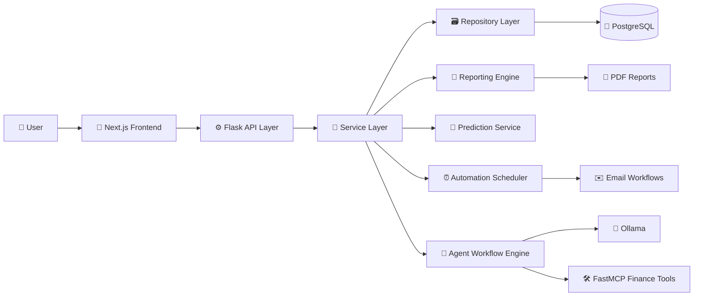

# 💸 Monetra

<p align="center">
  
  
  
  
  
</p>

<p align="center">
  
  
  
  
  
  
</p>

Monetra is a full-stack personal finance platform for expense tracking, recurring payment management, KPI analytics, PDF reporting, predictive forecasting, and local agentic AI workflows. It combines a `Next.js + React + TypeScript` frontend with a `Flask + PostgreSQL` backend and a local `Ollama` runtime for AI-assisted finance operations.

## 🌈 Highlights

- 💳 End-to-end expense CRUD with validation, search, import, and export
- 📅 Recurring reminder scheduling with paid-occurrence verification against transaction IDs
- 📊 KPI dashboards, trends, category concentration, runway, and financial pulse analytics
- 🧠 Local agentic AI workflows using tool-backed execution rather than free-form chat only
- 🔮 Next-month spending prediction using `scikit-learn`
- 📄 Multi-section PDF reporting with generated insights and summaries
- ✉️ Automated month-end and upcoming-bills email workflows
- 🧪 Strict testing with `100%` frontend and backend coverage

## ✨ Core Features

- 💸 Expense management: create, read, update, delete, and directly search transaction records
- 📥 CSV import pipeline: row cleaning, normalization, and invalid-row skipping
- 📤 CSV export: downloadable records for offline analysis and backup
- 📈 Analytics dashboard: monthly totals, weekly cadence, category mix, and trend visualizations
- ❤️ Financial health insights: spend velocity, runway, recent activity, and pulse metrics
- ☁️ Word cloud generation: prominent spend descriptions and top-category emphasis
- 🔁 Recurring payments: schedule planning, due-date tracking, pay/unpay flows, and calendar views
- 🤖 AI finance assistant: workflow planning, execution, verification, memory, and retries
- 🧾 Reporting engine: PDF financial reports with charts, commentary, and highlights
- 📬 Email automation: month-end close and upcoming-bills notifications
- 🔐 Demo-safe controls: optional read-only and gated-access modes for portfolio use

## 🧰 Tech Stack

### 🎨 Frontend

- 🔷 `Next.js 14`
- ⚛️ `React 18`
- 🟦 `TypeScript 5`
- 🧪 `Jest`
- 🧼 `React Testing Library`
- 🎭 `Playwright`
- 🥒 `Cucumber`

### ⚙️ Backend

- 🐍 `Python 3.13`
- 🌶️ `Flask`
- 🌐 `Flask-Cors`
- 🧱 `SQLAlchemy`
- 🐘 `PostgreSQL`
- 🔌 `psycopg`
- 📄 `ReportLab`
- 📉 `matplotlib`
- 🔢 `NumPy`
- 🔮 `scikit-learn`
- 🧪 `pytest`
- 📦 `gunicorn`

### 🤖 AI / ML Layer

- 🧠 `Ollama`
- 🔗 `LangChain-Ollama`
- 🕸️ `LangGraph`
- 🛠️ `FastMCP`

### 🐳 Tooling

- 🐳 `Docker`
- 🧪 `CircleCI`
- 🌿 `GitHub`

## 📚 Notable Libraries And Their Roles

- 🧩 `Flask` powers the HTTP API surface and app bootstrap
- 🧩 `SQLAlchemy` isolates persistence and schema interactions
- 🧩 `psycopg` connects the Flask service to PostgreSQL
- 🧩 `LangGraph` coordinates planner, executor, verifier, and retry flows
- 🧩 `FastMCP` exposes finance operations as structured tools to the agent layer
- 🧩 `LangChain-Ollama` connects local LLM inference to the workflow engine
- 🧩 `scikit-learn` drives next-month spending prediction from historical monthly totals
- 🧩 `ReportLab` generates multi-section PDF financial reports
- 🧩 `matplotlib` renders chart assets for reports and analytics
- 🧩 `Jest` and `React Testing Library` validate frontend logic and interaction flows
- 🧩 `Playwright` covers browser-level journeys
- 🧩 `Cucumber` supports behavior-driven scenario validation
- 🧩 `pytest` covers backend unit and integration behavior

## 🏛️ System Design

Monetra follows a `three-tier architecture` with a `modular monolith` backend.

- 🖥️ Presentation layer: `Next.js` dashboard and interactive finance surfaces
- ⚙️ Application layer: `Flask` API, service orchestration, reporting, automation, and AI workflows
- 🗃️ Data layer: `PostgreSQL` accessed through repository abstractions

### 🧭 Architecture Classification

- 🧱 `Three-tier application`
- 🧠 `Modular monolith backend`
- 🔌 `API-driven frontend/backend separation`
- 🛠️ `Tool-oriented AI workflow system`

### 🎯 Architectural Patterns

- 🏭 Application Factory Pattern
- 🧩 Blueprint Pattern
- 🧠 Service Layer Pattern
- 🗂️ Repository Pattern
- 🔌 API Client Adapter Pattern
- 🪝 Hook-based frontend orchestration
- 🧬 Composition over inheritance
- ⏳ Lazy initialization where appropriate

## 🗺️ Architecture Diagram



## 🧠 AI And ML Architecture

- 🤖 The AI layer is local-first and built around `Ollama`
- 🛠️ Finance operations are exposed as structured tools through `FastMCP`
- 🕸️ `LangGraph` orchestrates planning, execution, verification, and repair attempts
- 🧠 Agent traces include memory, execution results, verification output, and retry metadata
- 🔮 `scikit-learn` predicts next-month spending from historical monthly totals
- 📌 The AI layer is workflow-driven, not just prompt-driven, so mutations stay deterministic and auditable

## 🧱 Backend Architecture

### 📂 Backend Layers

- 🌐 `blueprints/` for HTTP endpoints and thin controller logic
- 🧠 `services/` for business rules, analytics, reporting, AI workflows, and automation
- 🗃️ `repositories/` for database reads and writes
- ⚙️ `config.py` for environment-driven application configuration
- 🛠️ `mcp/` for finance-tool exposure to the agent system

### 🪄 Backend Responsibilities

- 💸 expense validation and mutation flows
- 📊 analytics aggregation and KPI generation
- 🔮 prediction modeling and feature preparation
- 📄 PDF report generation
- 🔁 recurring-item state transitions and paid/unpaid occurrence logic
- 🤖 agent workflow execution and run history tracking
- ✉️ email drafting and automation scheduling

## 🖼️ Frontend Architecture

### 📂 Frontend Layers

- 🧭 `app/` for entrypoints and routing
- 🧩 `components/` for dashboard panels, forms, charts, tables, and AI surfaces
- 🪝 `hooks/` for orchestration and stateful finance workflows
- 🔌 `lib/` for centralized API access and utilities
- 🧪 `tests/` for unit, integration, E2E, and BDD validation

### 🎛️ Frontend Capabilities

- 📋 dashboard composition across KPI, analytics, records, automation, and AI panels
- 🔄 centralized data orchestration through hooks
- 🧠 agent workflow visibility with traces and run history
- 📆 recurring payment calendars and reminder state controls
- 📊 financial insights rendering and chart-driven summaries

## 🔄 Request / Data Flow

1. 👤 The user interacts with the dashboard in the browser.
2. 🎨 The frontend issues requests through the centralized API client.
3. 🌐 Flask blueprints receive and validate the request shape.
4. 🧠 Service-layer classes execute business logic.
5. 🗃️ Repository classes read from or write to PostgreSQL.
6. 🤖 AI and ML services derive predictions, summaries, plans, or reports when needed.
7. 📤 Structured responses return to the frontend for rendering.

## 🧪 Testing And Quality Assurance

### ✅ Testing Frameworks

- 🧪 Backend unit and integration tests with `pytest`
- 🧪 Frontend unit tests with `Jest`
- 🧪 Component and interaction tests with `React Testing Library`
- 🎭 Browser E2E tests with `Playwright`
- 🥒 BDD scenarios with `Cucumber`
- 🟦 Type-safety validation with `TypeScript` (`tsc --noEmit`)

### 🛡️ Quality Signals

- 💯 `100%` frontend coverage
- 💯 `100%` backend coverage
- 🔍 Separate unit and integration suites
- 🧭 Coverage around API, services, repositories, UI branches, hooks, and workflow traces
- 🔁 CI pipeline validation through `CircleCI`

## 🌐 API Surface

### ❤️ Health

- 🔹 `GET /api/health`

### 💸 Expenses

- 🔹 `GET /api/expenses`
- 🔹 `GET /api/expenses/<id>`
- 🔹 `POST /api/expenses`
- 🔹 `PUT /api/expenses/<id>`
- 🔹 `DELETE /api/expenses/<id>`
- 🔹 `POST /api/expenses/import`
- 🔹 `GET /api/expenses/export`

### 📊 Dashboard / Analytics

- 🔹 `GET /api/dashboard`
- 🔹 `GET /api/analytics/categories`
- 🔹 `GET /api/analytics/wordcloud`
- 🔹 `GET /api/analytics/financial-pulse`

### 🔮 Prediction / Reporting

- 🔹 `GET /api/predictions/next-month`
- 🔹 `GET /api/reports/monthly`

### 🔁 Recurring Items

- 🔹 `GET /api/recurring-items`
- 🔹 `POST /api/recurring-items`
- 🔹 `PUT /api/recurring-items/<id>`
- 🔹 `DELETE /api/recurring-items/<id>`
- 🔹 `GET /api/recurring-items/calendar`
- 🔹 `POST /api/recurring-items/<id>/occurrences/pay`
- 🔹 `POST /api/recurring-items/<id>/occurrences/unpay`

### 🤖 Agents / Automation

- 🔹 `GET /api/agents/workflows`
- 🔹 `POST /api/agents/workflows/<workflow_name>/run`
- 🔹 `GET /api/agents/runs`
- 🔹 `GET /api/agents/runs/<id>`

### ⚙️ Settings / Auth

- 🔹 `GET /api/settings`
- 🔹 `PUT /api/settings`
- 🔹 `GET /api/auth/session`

## 🗂️ Project Structure

```text
Monetra (Budget Tracker)/
├── backend/
│   ├── budget_tracker_api/
│   │   ├── blueprints/
│   │   ├── repositories/
│   │   ├── services/
│   │   ├── mcp/
│   │   └── config.py
│   ├── scripts/
│   ├── tests/
│   ├── run.py
│   └── wsgi.py
├── frontend/
│   ├── app/
│   ├── components/
│   ├── hooks/
│   ├── lib/
│   └── tests/
├── docker-compose.yml
└── README.md
```

## 🧪 Test Commands

### ⚙️ Backend

```bash
cd backend
python -m venv .venv
.venv\Scripts\activate
pip install -r requirements-dev.txt
pytest
```

### 🎨 Frontend

```bash
cd frontend
npm install
npm run test
npm run test:e2e
npm run test:bdd
npx tsc --noEmit
```

## 📝 Notes

- 📁 Generated PDF reports are written to `backend/generated_reports/`
- 🧠 The AI layer is local-model based rather than dependent on paid hosted inference APIs
- 🔐 The current system is designed as a single-user finance platform rather than a multi-tenant product
- 📌 The backend owns the core business logic; the frontend is intentionally API-driven and thin in business rules
