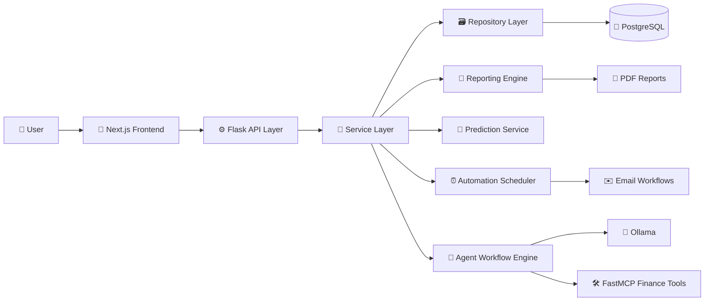

# 💸 Monetra

<p align="center">
  
  
  
  
  
</p>

<p align="center">
  
  
  
  
  
  
</p>

Monetra is a full-stack personal finance platform for expense tracking, recurring payment management, KPI analytics, PDF reporting, predictive forecasting, and local agentic AI workflows. It combines a `Next.js + React + TypeScript` frontend with a `Flask + PostgreSQL` backend and a local `Ollama` runtime for AI-assisted finance operations.

## Start Here

If you are new to this project, start with [docs/START_HERE.md](docs/START_HERE.md). It explains the safest order to run, test, stage, and deploy Monetra.

In simple terms, Monetra has four main parts:

- a browser app where users manage finance data
- a backend server that validates requests and stores data
- a PostgreSQL database for users and finance records
- a local AI layer for RAG questions, reports, and agent workflows

Recommended order:

1. Run locally with Docker.
2. Register a fake test user.
3. Check the core finance features.
4. Run automated tests.
5. Run dummy-user/load tests.
6. Deploy to staging.
7. Approve production deployment only after staging passes.

## 🌈 Highlights

- 💳 End-to-end expense CRUD with validation, search, import, and export
- 📅 Recurring reminder scheduling with paid-occurrence verification against transaction IDs
- 📊 KPI dashboards, trends, category concentration, runway, and financial pulse analytics
- 🧠 Local agentic AI workflows using tool-backed execution rather than free-form chat only
- 🔮 Next-month spending prediction using `scikit-learn`
- 📄 Multi-section PDF reporting with generated insights and summaries
- ✉️ Automated month-end and upcoming-bills email workflows
- 🧪 Strict testing with `100%` frontend and backend coverage
- 🧪 Dummy-user and load-test scenarios for staging-style validation

## ✨ Core Features

- 💸 Expense management: create, read, update, delete, and directly search transaction records
- 📥 CSV import pipeline: row cleaning, normalization, and invalid-row skipping
- 📤 CSV export: downloadable records for offline analysis and backup
- 📈 Analytics dashboard: monthly totals, weekly cadence, category mix, and trend visualizations
- ❤️ Financial health insights: spend velocity, runway, recent activity, and pulse metrics
- ☁️ Word cloud generation: prominent spend descriptions and top-category emphasis
- 🔁 Recurring payments: schedule planning, due-date tracking, pay/unpay flows, and calendar views
- 🎯 Savings goals: per-user savings targets with progress and remaining-balance tracking
- 🤖 AI finance assistant: workflow planning, execution, verification, memory, and retries
- 🧾 Reporting engine: PDF financial reports with charts, commentary, and highlights
- 📬 Email automation: month-end close and upcoming-bills notifications
- 🔐 Demo-safe controls: optional read-only and gated-access modes for portfolio use

## 🧰 Tech Stack

You do not need to understand every tool to run the app. The short version is:

- `Next.js` runs the browser app.
- `Flask` runs the backend API.
- `PostgreSQL` stores the finance data.
- `Docker Compose` starts the app services together.
- `Ollama` runs local AI models.
- `CircleCI` runs tests and, later, deployment.

### 🎨 Frontend

- 🔷 `Next.js 14`
- ⚛️ `React 18`
- 🟦 `TypeScript 5`
- 🧪 `Jest`
- 🧼 `React Testing Library`
- 🎭 `Playwright`
- 🥒 `Cucumber`

### ⚙️ Backend

- 🐍 `Python 3.13`
- 🌶️ `Flask`
- 🌐 `Flask-Cors`
- 🧱 `SQLAlchemy`
- 🐘 `PostgreSQL`
- 🔌 `psycopg`
- 📄 `ReportLab`
- 📉 `matplotlib`
- 🔢 `NumPy`
- 🔮 `scikit-learn`
- 🧪 `pytest`
- 📦 `gunicorn`

### 🤖 AI / ML Layer

- 🧠 `Ollama`
- 🔗 `LangChain-Ollama`
- 🕸️ `LangGraph`
- 🛠️ `FastMCP`

### 🐳 Tooling

- 🐳 `Docker`
- 🧪 `CircleCI`
- 🌿 `GitHub`

## 📚 Notable Libraries And Their Roles

- 🧩 `Flask` powers the HTTP API surface and app bootstrap
- 🧩 `SQLAlchemy` isolates persistence and schema interactions
- 🧩 `psycopg` connects the Flask service to PostgreSQL
- 🧩 `LangGraph` coordinates planner, executor, verifier, and retry flows
- 🧩 `FastMCP` exposes finance operations as structured tools to the agent layer
- 🧩 `LangChain-Ollama` connects local LLM inference to the workflow engine
- 🧩 `scikit-learn` drives next-month spending prediction from historical monthly totals
- 🧩 `ReportLab` generates multi-section PDF financial reports
- 🧩 `matplotlib` renders chart assets for reports and analytics
- 🧩 `Jest` and `React Testing Library` validate frontend logic and interaction flows
- 🧩 `Playwright` covers browser-level journeys
- 🧩 `Cucumber` supports behavior-driven scenario validation
- 🧩 `pytest` covers backend unit and integration behavior

## 🏛️ System Design

Monetra follows a `three-tier architecture` with a `modular monolith` backend.

- 🖥️ Presentation layer: `Next.js` dashboard and interactive finance surfaces
- ⚙️ Application layer: `Flask` API, service orchestration, reporting, automation, and AI workflows
- 🗃️ Data layer: `PostgreSQL` accessed through repository abstractions

### 🧭 Architecture Classification

- 🧱 `Three-tier application`
- 🧠 `Modular monolith backend`
- 🔌 `API-driven frontend/backend separation`
- 🛠️ `Tool-oriented AI workflow system`

### 🎯 Architectural Patterns

- 🏭 Application Factory Pattern
- 🧩 Blueprint Pattern
- 🧠 Service Layer Pattern
- 🗂️ Repository Pattern
- 🔌 API Client Adapter Pattern
- 🪝 Hook-based frontend orchestration
- 🧬 Composition over inheritance
- ⏳ Lazy initialization where appropriate

## 🗺️ Architecture Diagram



## 🧠 AI And ML Architecture

- 🤖 The AI layer is local-first and built around `Ollama`
- 🛠️ Finance operations are exposed as structured tools through `FastMCP`
- 🕸️ `LangGraph` orchestrates planning, execution, verification, and repair attempts
- 🧠 Agent traces include memory, execution results, verification output, and retry metadata
- 🔮 `scikit-learn` predicts next-month spending from historical monthly totals
- 📌 The AI layer is workflow-driven, not just prompt-driven, so mutations stay deterministic and auditable

## 🧱 Backend Architecture

### 📂 Backend Layers

- 🌐 `blueprints/` for HTTP endpoints and thin controller logic
- 🧠 `services/` for business rules, analytics, reporting, AI workflows, and automation
- 🗃️ `repositories/` for database reads and writes
- ⚙️ `config.py` for environment-driven application configuration
- 🛠️ `mcp/` for finance-tool exposure to the agent system

### 🪄 Backend Responsibilities

- 💸 expense validation and mutation flows
- 📊 analytics aggregation and KPI generation
- 🔮 prediction modeling and feature preparation
- 📄 PDF report generation
- 🔁 recurring-item state transitions and paid/unpaid occurrence logic
- 🤖 agent workflow execution and run history tracking
- ✉️ email drafting and automation scheduling

## 🖼️ Frontend Architecture

### 📂 Frontend Layers

- 🧭 `app/` for entrypoints and routing
- 🧩 `components/` for dashboard panels, forms, charts, tables, and AI surfaces
- 🪝 `hooks/` for orchestration and stateful finance workflows
- 🔌 `lib/` for centralized API access and utilities
- 🧪 `tests/` for unit, integration, E2E, and BDD validation

### 🎛️ Frontend Capabilities

- 📋 dashboard composition across KPI, analytics, records, automation, and AI panels
- 🔄 centralized data orchestration through hooks
- 🧠 agent workflow visibility with traces and run history
- 📆 recurring payment calendars and reminder state controls
- 📊 financial insights rendering and chart-driven summaries

## 🔄 Request / Data Flow

1. 👤 The user interacts with the dashboard in the browser.
2. 🎨 The frontend issues requests through the centralized API client.
3. 🌐 Flask blueprints receive and validate the request shape.
4. 🧠 Service-layer classes execute business logic.
5. 🗃️ Repository classes read from or write to PostgreSQL.
6. 🤖 AI and ML services derive predictions, summaries, plans, or reports when needed.
7. 📤 Structured responses return to the frontend for rendering.

## 🧪 Testing And Quality Assurance

### ✅ Testing Frameworks

- 🧪 Backend unit and integration tests with `pytest`
- 🧪 Frontend unit tests with `Jest`
- 🧪 Component and interaction tests with `React Testing Library`
- 🎭 Browser E2E tests with `Playwright`
- 🥒 BDD scenarios with `Cucumber`
- 🟦 Type-safety validation with `TypeScript` (`tsc --noEmit`)

### 🛡️ Quality Signals

- 💯 `100%` frontend coverage
- 💯 `100%` backend coverage
- 🔍 Separate unit and integration suites
- 🧭 Coverage around API, services, repositories, UI branches, hooks, and workflow traces
- 🔁 CI pipeline validation through `CircleCI`

## 🌐 API Surface

### ❤️ Health

- 🔹 `GET /api/health`

### 💸 Expenses

- 🔹 `GET /api/expenses`
- 🔹 `GET /api/expenses/<id>`
- 🔹 `POST /api/expenses`
- 🔹 `PUT /api/expenses/<id>`
- 🔹 `DELETE /api/expenses/<id>`
- 🔹 `POST /api/expenses/import`
- 🔹 `GET /api/expenses/export`

### 📊 Dashboard / Analytics

- 🔹 `GET /api/dashboard`
- 🔹 `GET /api/analytics/categories`
- 🔹 `GET /api/analytics/wordcloud`
- 🔹 `GET /api/analytics/financial-pulse`

### 🔮 Prediction / Reporting

- 🔹 `GET /api/predictions/next-month`
- 🔹 `GET /api/reports/monthly`

### 🔁 Recurring Items

- 🔹 `GET /api/recurring-items`
- 🔹 `POST /api/recurring-items`
- 🔹 `PUT /api/recurring-items/<id>`
- 🔹 `DELETE /api/recurring-items/<id>`
- 🔹 `GET /api/recurring-items/calendar`
- 🔹 `POST /api/recurring-items/<id>/occurrences/pay`
- 🔹 `POST /api/recurring-items/<id>/occurrences/unpay`

### 🎯 Savings Goals

- 🔹 `GET /api/savings-goals`
- 🔹 `POST /api/savings-goals`
- 🔹 `PUT /api/savings-goals/<id>`
- 🔹 `DELETE /api/savings-goals/<id>`

### 🤖 Agents / Automation

- 🔹 `GET /api/agents/workflows`
- 🔹 `POST /api/agents/workflows/<workflow_name>/run`
- 🔹 `GET /api/agents/runs`
- 🔹 `GET /api/agents/runs/<id>`

### ⚙️ Settings / Auth

- 🔹 `GET /api/settings`
- 🔹 `PUT /api/settings`
- 🔹 `PUT /api/settings/income`
- 🔹 `GET /api/auth/session`
- 🔹 `POST /api/auth/register`
- 🔹 `POST /api/auth/login`
- 🔹 `POST /api/auth/forgot-password`
- 🔹 `POST /api/auth/reset-password`
- 🔹 `POST /api/auth/logout`

## 🗂️ Project Structure

```text
Monetra (Budget Tracker)/
├── backend/
│   ├── budget_tracker_api/
│   │   ├── blueprints/
│   │   ├── repositories/
│   │   ├── services/
│   │   ├── mcp/
│   │   └── config.py
│   ├── scripts/
│   ├── tests/
│   ├── run.py
│   └── wsgi.py
├── frontend/
│   ├── app/
│   ├── components/
│   ├── hooks/
│   ├── lib/
│   └── tests/
├── docker-compose.yml
└── README.md
```

## 🚀 Run Locally

### Prerequisites

- `Docker Desktop` with Docker Compose
- `Node.js 22+`
- `Python 3.11+`
- `Ollama` running on the host machine for AI/RAG features

Pull the local AI models used by Monetra:

```powershell
ollama pull qwen2.5:7b
ollama pull nomic-embed-text
```

### Recommended: Docker Compose

From the repository root:

```powershell
cd "Monetra (Budget Tracker)"
docker compose up -d --build
```

Open:

| Surface | URL |
| --- | --- |
| Frontend | `http://localhost:3000` |
| Backend API | `http://localhost:8000` |
| Health check | `http://localhost:8000/api/health` |
| Chroma RAG store | `http://localhost:8001` |

The Docker backend expects Ollama at `http://host.docker.internal:11434`, so Ollama must be running before using agentic AI or RAG features.

Email safety is explicit:

```env
EMAIL_MODE=hybrid
SMTP_HOST=smtp.gmail.com
SMTP_PORT=587
SMTP_USER=rushabh.dharamshi@gmail.com
SMTP_PASSWORD=your_gmail_app_password
SMTP_USE_TLS=true
SMTP_REQUIRE_AUTH=true
EMAIL_FROM=rushabh.dharamshi@gmail.com
ALLOWED_TEST_EMAILS=rushabh.dharamshi@gmail.com,testpurposes683@gmail.com,rushlovesgames28@gmail.com,rushabh.is.cool28@gmail.com
EMAIL_MOCK_DOMAINS=monetra.test,example.test
MOCK_EMAIL_FROM=demo@monetra.test
```

In hybrid mode, Monetra decides per recipient: allowlisted Gmail addresses are sent through Gmail SMTP, fake addresses on `@monetra.test` or `@example.test` are recorded as simulated emails, and every other recipient is blocked. For full dummy/load tests, `EMAIL_MODE=mock` is still available; no SMTP connection is opened and no real email is sent.

Demo users can view simulated reset-code and report emails from the **Forgot password -> Demo email inbox** panel. Enter a mock address such as `user001@monetra.test` and refresh the inbox. Real Gmail recipients never appear in this panel.

### First Local Smoke Test

1. Open `http://localhost:3000`.
2. Register a new test user.
3. Log out and log back in.
4. Add an income transaction and an expense transaction.
5. Update the monthly budget and income.
6. Create a recurring payment.
7. Create a savings goal.
8. Generate the monthly report.
9. Reindex RAG and ask a finance question.
10. Run an agent workflow.

### Local Validation Helper

Run code tests only:

```powershell
cd "Monetra (Budget Tracker)"
powershell -ExecutionPolicy Bypass -File scripts\validate-local.ps1 -SkipDocker
```

Run tests plus local Docker health checks:

```powershell
powershell -ExecutionPolicy Bypass -File scripts\validate-local.ps1
```

Run dummy-user/load tests after the Docker stack is up:

```powershell
powershell -ExecutionPolicy Bypass -File scripts\validate-local.ps1 -SkipBackend -SkipFrontend -RunLoad
```

Do not run dummy-user/load tests while real Gmail SMTP is active. Use `EMAIL_MODE=mock` for dummy users such as `user001@monetra.test`; Monetra records simulated sends without delivering real email.

The dummy-user suite is intentionally rigorous. It checks auth, data isolation, full finance workflows, concurrent reads/writes, invalid inputs, reports, RAG/agent resilience, and API latency thresholds. Details are in `docs/DUMMY_USER_LOAD_TESTING.md`.

Record a local latency baseline:

```powershell
$env:MONETRA_LATENCY_USERNAME="your-test-username"
$env:MONETRA_LATENCY_PASSWORD="your-test-password"
powershell -ExecutionPolicy Bypass -File scripts\measure-latency.ps1 -Environment local -BaseUrl http://localhost:8000 -Iterations 20
```

For multiple users, create a CSV such as `latency-users.local.csv`:

```csv
label,username,password
primary,Rushabh,password-for-that-account
test-683,testpurposes683@gmail.com,password-for-that-account
```

Then run:

```powershell
powershell -ExecutionPolicy Bypass -File scripts\measure-latency.ps1 -Environment local -BaseUrl http://localhost:8000 -Iterations 20 -UserCredentialCsv .\latency-users.local.csv
```

The script writes raw CSV, summary CSV, summary JSON, Markdown, and HTML reports to `latency-results/`. Each user/run gets a `report_id`, and every API call gets a `request_id` with timestamp, endpoint, status code, and latency. Use the same script later with your staging or production URL to compare environments. If you skip credentials, public endpoints such as `/api/health` still work, but protected endpoints may return `401`.

### Manual Dev Mode

Use this when you want backend/frontend hot reload instead of Docker.

Backend:

```powershell
cd "Monetra (Budget Tracker)/backend"
python -m venv .venv
.\.venv\Scripts\Activate.ps1
pip install -r requirements-dev.txt
python run.py
```

Frontend:

```powershell
cd "Monetra (Budget Tracker)/frontend"
npm ci
$env:API_PROXY_TARGET="http://127.0.0.1:5000"
npm run dev
```

Manual dev URLs:

| Surface | URL |
| --- | --- |
| Frontend | `http://localhost:3000` |
| Backend API | `http://127.0.0.1:5000` |

### Local Environment Notes

- Keep real secrets in `backend/.env`; do not commit that file.
- Use only email accounts you own when real Gmail SMTP is active, and add each one to `EMAIL_ALLOWED_RECIPIENTS` or `ALLOWED_TEST_EMAILS`.
- SMTP/email automation only works when email delivery is configured. Use `EMAIL_MODE=hybrid` when you want allowlisted Gmail recipients to receive real email while fake demo recipients are simulated. Use `EMAIL_MODE=real` for real SMTP only and `EMAIL_MODE=mock` for dummy/load testing only. The older `EMAIL_DELIVERY_MODE=smtp/dry_run` names are still supported.
- Agentic AI and RAG require Ollama plus the `qwen2.5:7b` and `nomic-embed-text` models.
- Full local validation before Oracle deployment is documented in `docs/LOCAL_VALIDATION_RUNBOOK.md`.

### Common Local Problems

| Problem | What To Check |
| --- | --- |
| Frontend does not open | Check Docker Desktop is running, then run `docker compose ps`. |
| Backend health check fails | Run `docker compose logs backend` and check PostgreSQL started correctly. |
| Login/register fails | Confirm the backend is running and cookies are not blocked by the browser. |
| AI/RAG does not answer | Confirm Ollama is running and both models were pulled. |
| RAG indexing fails | Confirm Chroma is running at `http://localhost:8001`. |
| Email does not send | Confirm SMTP settings exist in `backend/.env`; local testing can run without email. |
| Port already in use | Stop the other app using ports `3000`, `8000`, `8001`, or `5432`, or change the Docker ports. |

Useful commands:

```powershell
docker compose ps
docker compose logs backend
docker compose logs frontend
docker compose down
```

## 🧪 Test Commands

### ⚙️ Backend

```bash
cd backend
python -m venv .venv
.venv\Scripts\activate
pip install -r requirements-dev.txt
pytest
```

### 🎨 Frontend

```bash
cd frontend
npm install
npm run test
npm run test:e2e
npm run test:bdd
npx tsc --noEmit
```

### 🧪 Load / Dummy-User Simulation

```bash
cd "Monetra (Budget Tracker)"
docker compose --profile load run --rm load-test-runner
```

### 🧯 Controlled Chaos Drills

```powershell
cd "Monetra (Budget Tracker)"
powershell -ExecutionPolicy Bypass -File chaos\run-controlled-chaos.ps1 -Drill ChaosSmoke
powershell -ExecutionPolicy Bypass -File chaos\run-controlled-chaos.ps1 -Drill ChromaOutage
powershell -ExecutionPolicy Bypass -File chaos\run-controlled-chaos.ps1 -Drill PostgresOutage
```

## 📘 Production-Readiness Docs

- `docs/START_HERE.md` explains what to read first and the safest local-to-production order
- `docs/GLOSSARY.md` explains common technical terms in plain English
- `docs/MONETRA_CHECKLIST.md` maps the app against the production-grade AI fintech checklist
- `docs/API.md` documents the REST API surface
- `docs/DEPLOYMENT.md` covers Docker, secrets, smoke checks, and rollback notes
- `docs/LOCAL_VALIDATION_RUNBOOK.md` gives the local-first test path before Oracle VM deployment
- `docs/DUMMY_USER_LOAD_TESTING.md` explains the rigorous fake-user concurrency and latency test suite
- `docs/TESTING_STRATEGY.md` explains backend, frontend, E2E, load, and CI gates
- `docs/FAULT_INJECTION.md` lists controlled staging failure scenarios and expected behavior

## 📝 Notes

- 📁 Generated PDF reports are written to `backend/generated_reports/`
- 🧠 The AI layer is local-model based rather than dependent on paid hosted inference APIs
- 🔐 The interactive app supports registered users with per-user finance records and settings
- 📌 The backend owns the core business logic; the frontend is intentionally API-driven and thin in business rules
