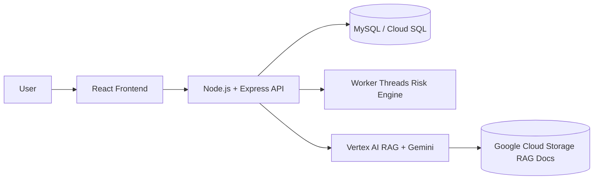

# 🚀 Project Management Tool

<p align="left">
  
  
  
  
  
  
  
</p>

Production-oriented project operations platform with task execution workflows, analytics dashboards, ML-style risk scoring, and a Vertex AI RAG chatbot assistant.

## ✨ Core Functionality

- 📁 Project management: create/list/delete projects with duplicate-name guardrails.
- ✅ Task lifecycle management: create/edit/delete tasks with strict validation.
- 🔄 Status guardrails: `done` status and completion are only allowed when progress is `100%`.
- 📊 Analytics dashboard: category mix, status distribution, completion velocity (14-day trend), and assignee workload.
- 🧠 ML risk engine: heuristic risk scoring with recommendations and persisted risk labels/scores.
- 💬 RAG chatbot assistant: users ask natural-language questions grounded in project/task context.
- 🗂️ Multi-view execution UI: list view + Kanban board for day-to-day planning.

## 🧰 Tech Stack

### 🎨 Frontend
- React
- React-Bootstrap + Bootstrap
- Chart.js + react-chartjs-2
- Fetch API for backend communication

### ⚙️ Backend
- Node.js
- Express
- mysql2 (promise pool)
- Security/perf middleware: Helmet, CORS, compression, express-rate-limit

### 🗄️ Data Layer
- MySQL schema for `projects` and `tasks`
- Analytics-oriented fields: status, priority, difficulty, assignee, estimated hours, risk score/level
- Auto-initialized schema + compatible `ALTER` migration logic

### 🤖 AI / ML / GenAI
- Vertex AI RAG Engine
- Gemini `gemini-3.1-pro-preview`
- Google Cloud Storage sync/import scripts for RAG corpus updates
- Custom risk scoring engine (worker-thread parallel execution)

### 🚢 DevOps / Deployment
- Dockerized frontend and backend (`client/Dockerfile`, `server/Dockerfile`)
- Multi-stage frontend build served via Nginx
- Cloud Run-ready runtime configuration
- Cloud SQL socket-compatible backend config

### 🧪 Testing
- Unit tests (Jest)
- Route/API behavior tests (Supertest)
- Integration tests (API + DB flows)
- BDD tests using `jest-cucumber` (`.feature` + step definitions)

## 🏗️ Architectural Design

### High-Level Architecture



### Backend Layering

```text
Routes -> Services -> Repositories -> MySQL
```

- **Routes**: request handling + HTTP responses.
- **Services**: validation, business rules, risk/AI orchestration.
- **Repositories**: SQL access and analytics query composition.
- **DB**: relational persistence and aggregate reporting data.

### RAG Assistant Flow

1. Export SQL-backed project/task data into text documents.
2. Upload documents to GCS and import into Vertex RAG corpus.
3. Retrieve relevant context using Vertex RAG.
4. Generate grounded answers with Gemini `gemini-3.1-pro-preview`.
5. Return chatbot response to UI with request latency metadata.

## ⚡ Performance & Concurrency Highlights

- `worker_threads` worker pool for parallel risk scoring.
- Async I/O + `Promise.all` for concurrent backend operations.
- MySQL connection pooling for stable throughput.
- Response compression and rate limiting for API resilience.
- Latency tracking for chatbot calls.

## 📦 Project Structure

```text
client/      # React UI, charts, Kanban/list workflows
server/      # Express APIs, services, repositories, tests, AI/RAG scripts
database/    # SQL schema
```
